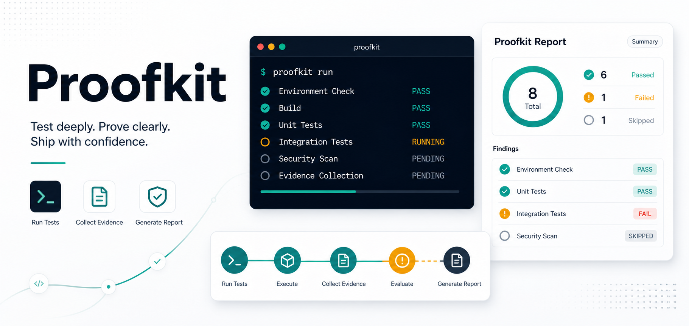

# Proofkit



Drive terminal apps, record sessions, and produce evidence packs that prove a
TUI or CLI behaved correctly end-to-end.

[Docs](https://proofkit-docs.pages.dev) ·
[Package README](./packages/tui-proof-kit/README.md) ·
[Changelog](./packages/tui-proof-kit/CHANGELOG.md) ·
[Contributing](./CONTRIBUTING.md)

## What it does

Proofkit launches your terminal app in a real PTY, renders the screen with
`@xterm/headless`, drives the flow with state-based actions, and writes a
shareable HTML report with findings, captured frames, diffs, and a replayable
cast.

Use it when stdout assertions are too shallow and you need to prove the actual
terminal screen did the right thing.

## Install

```bash
npm install @capxul/tui-test-kit
```

Requirements:

- Node.js 22 or newer.
- A working native build toolchain for `node-pty`.

## Quick Start

```ts
import { defineProof } from "@capxul/tui-test-kit";

const proof = defineProof({
  id: "hello",
  title: "Greeting flow",
  cwd: process.cwd(),
  handoffRoot: "./evidence/hello",
  width: 80,
  height: 24,
});

await proof.run({
  launch: {
    command: "node",
    args: ["--experimental-strip-types", "hello.ts"],
  },
  steps: [
    {
      id: "greet",
      actions: [
        { expectText: "What is your name?", timeoutMs: 5_000 },
        { type: "Alice" },
        { press: "Enter" },
        { expectText: "Hello, Alice!", timeoutMs: 5_000 },
        { expectSnapshot: "greeting" },
      ],
    },
  ],
  verify: (ctx) => {
    ctx.finding({
      status: "pass",
      title: "Greeting verified",
      body: "Prompt appeared, input was submitted, and the final screen matched.",
    });
  },
});
```

Run the proof:

```bash
PROOFKIT_UPDATE_SNAPSHOTS=1 node --experimental-strip-types proofs/hello.proof.ts
```

Proofkit writes:

- `REPORT.html` with findings, snapshots, diffs, and replay.
- `casts/` with asciinema-compatible recordings.
- `captures/` with captured terminal frames.

## Documentation

The full documentation site covers:

- [Getting started](https://proofkit-docs.pages.dev/docs/getting-started)
- [Driving create-next-app](https://proofkit-docs.pages.dev/docs/tutorial-create-next-app)
- [Action reference](https://proofkit-docs.pages.dev/docs/reference/actions)
- [Mental model](https://proofkit-docs.pages.dev/docs/concepts/mental-model)
- [Architecture](https://proofkit-docs.pages.dev/docs/concepts/architecture)

## Repository Layout

```text
apps/
  fumadocs/            documentation site
packages/
  tui-proof-kit/       published framework package
  config/              shared TypeScript config
docs/
  adrs/                architecture decision records
  research/            supporting research notes
```

## Development

```bash
pnpm install
pnpm test
pnpm build
pnpm check
pnpm check-types
```

This repository uses pnpm, Turborepo, Changesets, oxlint, oxfmt, and lefthook.

## Release Status

The published npm package is
[`@capxul/tui-test-kit`](https://www.npmjs.com/package/@capxul/tui-test-kit).
GitHub releases are not currently used as the release source of truth.

## License

MIT. See [LICENSE](./LICENSE).
