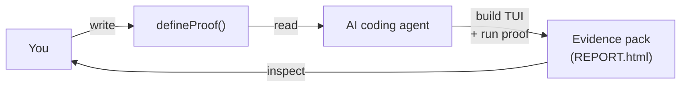

**Proofkit is the contract between you and the AI agent building your TUI.**

You write a `defineProof()` spec describing what the finished terminal app must do. Your AI coding agent reads that spec and builds toward it. When the agent runs the proof, the structured evidence pack it produces is the artifact that proves the contract was met.

It is test-driven development for AI-built TUIs, where the test is the contract.

## The loop



You write the contract. The agent reads it, builds the TUI toward it, runs the proof, and hands back an evidence pack. You inspect the pack to confirm the contract was met — or to see precisely where it wasn't.

## Who this is for

TUI application developers whose AI coding agents (Claude Code, Codex, and similar) write the TUI for them. Proofkit gives the agent something concrete to build against and gives you something concrete to inspect when it claims it's done.

If you are hand-writing every line of your TUI yourself, you can still use Proofkit as a terminal test runner. The design just assumes an agent is on the other side of the proof.

## The loop in detail

1. **You write `defineProof()`.** You declare the id, the screen dimensions, the steps the TUI must support, and a `verify` function that decides pass or fail. This is the requirements document — no ambiguity, no "did you mean".
2. **The agent reads the proof and builds the TUI toward it.** Every action, every `expectText`, every snapshot is a constraint the agent must satisfy. The proof tells it what success looks like before it writes a line of code.
3. **The agent runs the proof.** Proofkit launches the TUI in a real PTY via `node-pty`, renders the screen with `@xterm/headless`, drives the flow with state-based actions, and captures every frame, snapshot, and cast.
4. **You read the evidence pack.** A `REPORT.html` with findings, golden-frame snapshots, diffs against any baselines, and a replayable asciinema cast. The pack is proof — that the contract was fulfilled, or precisely where it wasn't.

## A worked example

The package README has a runnable quickstart at [`packages/tui-proof-kit/README.md`](https://github.com/Xelmar-tech/proofkit/blob/main/packages/tui-proof-kit/README.md). The shape:

```ts
const proof = defineProof({ id, title, cwd, handoffRoot, width, height });
await proof.run({ launch, steps, verify });
```

You install it with:

```bash
npm install @capxul/tui-test-kit
```

You need Node.js 22 or newer and a working native toolchain for `node-pty`.

## Agent plugins

Proofkit ships with first-party plugins that teach your coding agent how to read, write, and run proofs:

- **Claude Code plugin** — coming in v1 (milestone E4).
- **Codex plugin** — coming in v1 (milestone E5).

No MCP server, no extra wiring — the plugins are skill packs the agent loads.

## Where to go next

- [Getting started](/docs/getting-started) — install, scaffold your first proof, run it.
- [Action reference](/docs/reference/actions) — every action you can put in a step.
- [Mental model](/docs/concepts/mental-model) — how Proofkit thinks about screens, frames, and findings.
- [Architecture](/docs/concepts/architecture) — the moving pieces and why they exist.
- [Decisions](/docs/concepts/decisions) — architectural decision records.
