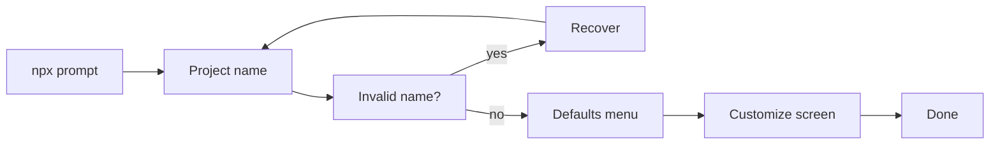

This tutorial walks through the showcase proof that drives `create-next-app` end-to-end — from the npx install prompt through the customize screen.

You'll see: state-driven gates, golden-frame snapshots, arrow-key navigation, input-validation recovery, and redactors.

The full source is at `packages/tui-proof-kit/examples/drive-create-next-app.ts` in the repo.

## What this proof does



It exercises every public framework feature:

| Feature                            | Where                                    |
| ---------------------------------- | ---------------------------------------- |
| `expectText` as state gate         | Every step                               |
| `expectSnapshot` (golden frames)   | 5 snapshot assertions                    |
| `type` / `press` / `Backspace`     | Name entry + recovery                    |
| Arrow-key menu navigation          | Down arrow to select "customize"         |
| `redactors` (pattern substitution) | Version number drift, spinner artifacts  |
| `prepare()` hook                   | Cleans sandbox directories before launch |

## Step 1: Install confirm

`create-next-app` is fetched via npx. The first screen asks for permission:

```
Need to install the following packages:
  create-next-app@15.3.0
Ok to proceed? (y)
```

Our proof waits for the prompt text, snapshots the screen, then types "y" + Enter:

```ts
{
  id: "install-confirm",
  actions: [
    { expectText: "Ok to proceed?", timeoutMs: 60_000 },
    { expectSnapshot: "01-install-confirm" },
    { type: "y" },
    { press: "Enter" },
  ],
},
```

**Key pattern:** `expectText` is a **gate**. The proof doesn't proceed to the snapshot until the npx prompt is actually visible. No `sleep(5000)` needed — if npx takes 3 seconds or 60 seconds, the proof adapts.

The saved snapshot (`01-install-confirm.txt`) looks like:

```
Need to install the following packages:
  create-next-app@<version>
Ok to proceed? (y)
```

Notice `<version>` — the real version number is redacted (see "Redactors" below).

## Step 2: Project name (bad)

`create-next-app` asks for a project name. We intentionally enter a name with spaces to trigger the validation error:

```ts
{
  id: "name-bad",
  actions: [
    { expectText: "What is your project named?", timeoutMs: 90_000 },
    { expectSnapshot: "02-name-default" },
    { type: "tui proof kit" },
    { press: "Enter" },
  ],
},
```

The `expectSnapshot` captures the default state (before we type) — the cursor blinking at the end of the default name suggestion.

## Step 3: Validation error

`create-next-app` rejects the space-containing name:

```
Invalid project name: "tui proof kit"
```

```ts
{
  id: "validation-error",
  actions: [
    { expectText: "Invalid project name", timeoutMs: 10_000 },
    { expectSnapshot: "03-validation-error" },
  ],
},
```

No `type` or `press` actions here — this step is purely an observation. The proof verifies the error appeared and snapshots it.

## Step 4: Recover from validation error

We clear the bad input with Backspace and retype:

```ts
{
  id: "fix-name",
  actions: [
    // Backspace once per character in the bad name.
    ...Array.from({ length: 13 }, () => ({ press: "Backspace" as const })),
    { type: "tui-proof-kit" },
    { press: "Enter" },
  ],
},
```

**Key pattern:** `...Array.from(...)` dynamically generates actions. The Backspace count equals the bad name's length — change the name and the backspace count follows automatically.

## Step 5: Defaults menu (arrow-key navigation)

`create-next-app` presents a menu:

```
Would you like to use the recommended Next.js defaults?
  > Yes, use defaults
    No, customize settings
```

We navigate with Down arrow and press Enter to select "customize":

```ts
{
  id: "defaults-menu",
  actions: [
    { expectText: "recommended Next.js defaults", timeoutMs: 30_000 },
    { expectSnapshot: "04-defaults-menu" },
    { press: "Down" },
    { press: "Enter" },
  ],
},
```

**Key pattern:** `expectText` uses a substring — "recommended Next.js defaults" — not the full prompt. This is intentional: full-prompt matching is fragile against minor copy changes. Match the semantic anchor.

## Step 6: Customize screen

The customize screen shows each option as a toggle. We wait for "TypeScript" to appear (a unique anchor on this screen) and snapshot:

```ts
{
  id: "customize-screen",
  actions: [
    { expectText: "TypeScript", timeoutMs: 15_000 },
    { expectSnapshot: "05-customize-screen" },
  ],
},
```

This works even though "TypeScript" appeared on earlier screens — the virtual screen model has overwritten those frames. The text "TypeScript" on this screen is the _only_ occurrence visible right now.

## Redactors

Two patterns drift over time and would cause snapshot mismatches on every run. Redactors strip them:

```ts
redactors: [
  {
    pattern: /create-next-app@\d+\.\d+\.\d+/g,
    replacement: "create-next-app@<version>",
  },
  {
    pattern: /[⠀-⣿]/g,  // Unicode Braille spinner characters
    replacement: "",
  },
],
```

Redactors run on every captured frame before it's written or compared. The version pattern is obvious; the Braille pattern strips npx's animated spinner (those characters change frame-by-frame and aren't load-bearing for assertions).

## The prepare() hook

Before each run, we clean the sandbox directories:

```ts
prepare: async () => {
  rmSync(TMP_DIR, { recursive: true, force: true });
  rmSync(SANDBOX_HOME, { recursive: true, force: true });
  mkdirSync(TMP_DIR, { recursive: true });
  mkdirSync(SANDBOX_HOME, { recursive: true });
},
```

The sandbox HOME is critical: without it, npx would see the user's real `~/.npm` cache and might skip the install-confirm prompt on repeat runs. Pointing HOME at an empty directory guarantees the prompt appears every time.

## Running it

```bash
# First run: record snapshots
PROOFKIT_UPDATE_SNAPSHOTS=1 node --experimental-strip-types examples/drive-create-next-app.ts

# Subsequent runs: verify against saved snapshots
node --experimental-strip-types examples/drive-create-next-app.ts
```

Open `evidence/drive-create-next-app/drive-create-next-app-REPORT.html` to see the full report with findings, diffs, and the embedded replay cast.

## What you've learned

1. **State-driven gates** (`expectText`) replace fixed sleeps — the proof runs as fast as the app.
2. **Golden-frame snapshots** (`expectSnapshot`) catch visual regressions in full-screen TUIs.
3. **Dynamic actions** (`Array.from`) scale with input length — no hardcoded counts.
4. **Arrow-key navigation** works because the framework types into a real PTY.
5. **Redactors** strip non-deterministic content (spinners, versions) without mutating the TUI.
6. **`prepare()` hooks** set up hermetic test environments — no user-level side effects.
